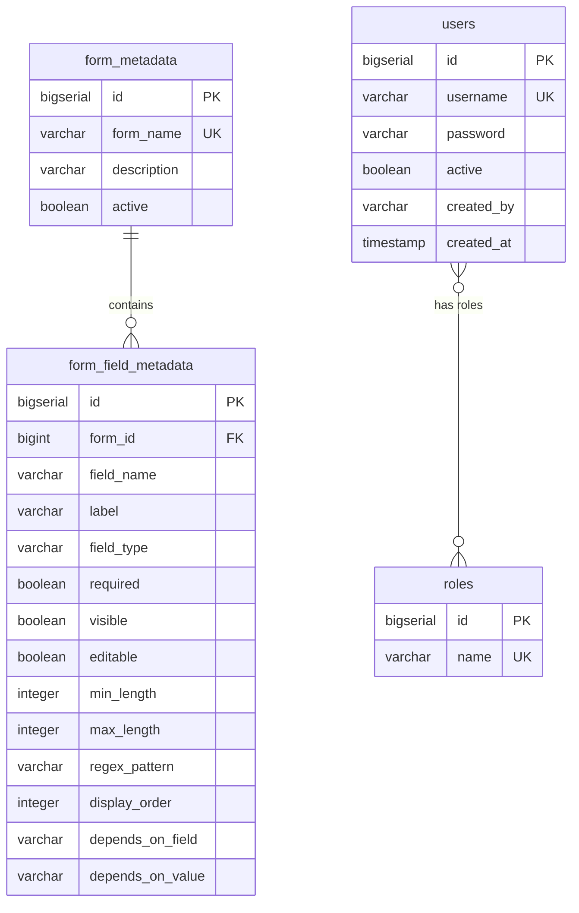

# Dynamic Form-Based Spring Boot Microservice

A production-ready, enterprise-grade Spring Boot 3.x microservice that implements **metadata-driven dynamic forms** and
family member management. The service features a fully generic, dynamic validation framework, JWT authentication with
roleEntity-based security, comprehensive auditing, soft deletion, and containerized deployment options.

---

## Technical Stack
* **Java 17** & **Spring Boot 3.2.4**
* **Maven** (build automation)
* **PostgreSQL** (production DB) & **H2** (in-memory test DB)
* **Spring Data JPA** (ORM layer)
* **Flyway Migration** (database migrations versioning)
* **Lombok** (boilerplate reduction)
* **MapStruct 1.5.5.Final** (high-performance type-safe DTO mapping)
* **Spring Security & JSON Web Token (JJWT 0.11.5)** (security and authorization)
* **Springdoc OpenAPI (Swagger UI)** (automated API documentation)
* **JUnit 5 & Mockito** (robust unit and integration testing)
* **Docker & Docker Compose** (infrastructure containerization)

---

## Architectural Highlights

### 1. Metadata-Driven Forms
Rather than hardcoding forms, the UI renders components dynamically by invoking the metadata APIs. Form structures, display orders, validation rules (min/max length, regex patterns, field types), and visibility rules are loaded dynamically from the database.

### 2. Generic Validation Engine
The `DynamicValidationService` evaluates raw payloads against database constraints loaded from `FormFieldMetadata`. Features:
* **Type Safety Checks**: Confirms string payloads conform to numeric or date formats dynamically.
* **Length Constraints**: Enforces `minLength` and `maxLength` constraints.
* **Regex Enforcement**: Matches field values against standard regular expressions (Aadhaar, PAN, Mobile patterns).
* **Conditional Validations**: Integrates dependent field rules. (e.g. `disability_percentage` is dynamically marked required and validated only when `handicapped` is true).

### 3. Auditing & Soft Deletion
* Core entities extend `Auditable`, registering JPA listeners to automatically track `created_by`, `created_at`, `updated_by`, and `updated_at`.
* Features **soft deletion** where records are flagged with `active = false` alongside `deleted_by` and `deleted_at` audit tags, rather than executing hard SQL deletes.

---

## Database Design



---

## REST API Documentation

### 1. Authentication Endpoints
* `POST /api/auth/login`
  * Body: `{"username": "admin", "password": "admin123"}`
  * Response returns a JWT token, username, and assigned roles/authorities.

### 2. Metadata API
* `GET /api/forms` - Get all active forms.
* `GET /api/forms/{formName}` - Fetch metadata configuration for a form.
* `GET /api/forms/{formName}/fields` - Fetch fields for a form sorted by order.

### 3. Education Module
* `GET /api/education` - Retrieve active education records.
* `GET /api/education/{id}` - Get education record by ID.
* `POST /api/education` - Create a new record (requires CREATE authority).
* `PUT /api/education/{id}` - Update a record (requires UPDATE authority).
* `DELETE /api/education/{id}` - Soft-delete record (requires DELETE authority - ADMIN roleEntity).

### 4. Family Module
* `GET /api/family` - Retrieve active family members.
* `GET /api/family/{id}` - Get family member by ID.
* `POST /api/family` - Create family member.
* `PUT /api/family/{id}` - Update family member.
* `DELETE /api/family/{id}` - Soft-delete family member (ADMIN only).

---

## Local Development & Setup

### Running with Docker Compose
To launch the Spring Boot microservice and a PostgreSQL database container together:
```bash
docker-compose up --build
```
The application will start on port `8080`.

### Running with Maven
1. Ensure a PostgreSQL instance is running with a database named `forms_db` on port `5432`.
2. Configure username and password in `application.yml` or set environment variables `DB_USER` and `DB_PASSWORD`.
3. Compile and launch the app:
   ```bash
   mvn clean spring-boot:run
   ```

### Swagger UI
Once running, the interactive Swagger console is available at:
* [http://localhost:8080/swagger-ui.html](http://localhost:8080/swagger-ui.html)
* Authorize requests by clicking the "Authorize" button and pasting your JWT token as a `Bearer <token>` payload.
