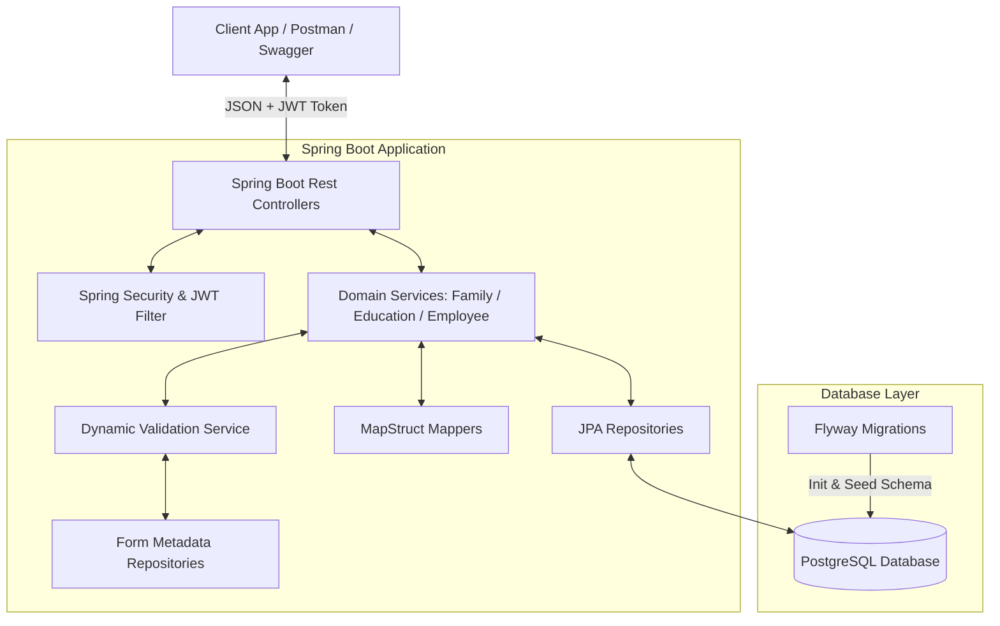
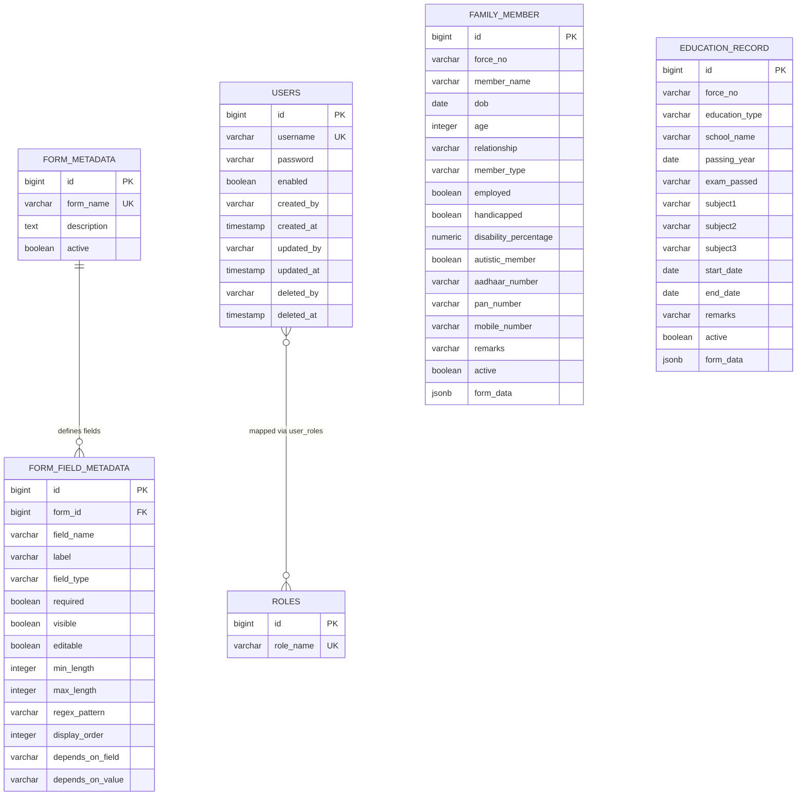
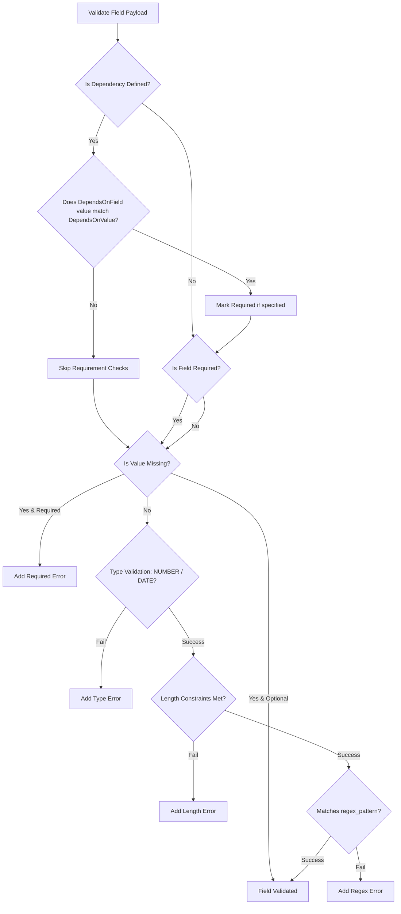

# Dynamic Form-Based Microservice System Documentation

This document provides a comprehensive, technical overview of the **Dynamic Form-Based Spring Boot Microservice**. It is designed to serve as a complete reference guide for developers, system administrators, and architects working with or deploying this project.

---

## 1. System Overview & Architecture

The application is an enterprise-grade, metadata-driven microservice built on **Spring Boot 3.2.4** and **Java 17**. Unlike traditional applications with hardcoded structures and validation rules, this microservice renders and validates forms dynamically using schema configurations stored in a database.



### Key Architectural Highlights
- **Metadata-Driven Forms:** Forms (such as `education` and `family`) are defined dynamically using database records. This allows fields, data types, constraints, display order, and conditional rules to be loaded and customized at runtime without rebuilding the application.
- **Dynamic validation engine:** A single generic validator evaluates incoming JSON request payloads against field-level constraints (data types, character lengths, regex patterns, and conditional requirements) loaded from database metadata.
- **Hybrid Data Modeling:** Traditional fields are combined with a `jsonb` field (`form_data`) to capture customized dynamic form attributes.
- **Auditing & Soft Deletion:** Tracks entities using JPA Auditing listeners (`Auditable` base class). Deletion operations flag records as inactive (`active = false`) and log soft deletion metadata rather than executing physical `DELETE` statements.
- **Stateless JWT Security:** Implements Spring Security configured with JSON Web Tokens (JWT) for authentication and role-based permissions (authorization checks performed via `@PreAuthorize` annotations on API endpoints).

---

## 2. Core Modules & Component Architecture

The codebase is organized into clean, logic-separated Java packages under `com.crpf.forms`:

| Package | Purpose | Core Classes |
| :--- | :--- | :--- |
| **`config`** | Application configuration beans. | `SecurityConfig`, `AuditConfig`, `SwaggerConfig` |
| **`controller`** | REST endpoints mapped to specific URIs. | `AuthController`, `MetadataController`, `EducationController`, `FamilyController`, `EmployeeController` |
| **`dto`** | Data Transfer Objects representing payloads. | `AuthRequest`, `AuthResponse`, `EducationRecordRequest`, `FamilyMemberRequest`, `FormMetadataResponse` |
| **`entity`** | JPA Entities mapping to PostgreSQL tables. | `FormMetadata`, `FormFieldMetadata`, `EducationRecord`, `FamilyMember`, `EmployeeMasterEntity`, `User`, `Role`, `Auditable` |
| **`repository`**| Spring Data JPA Database interfaces. | `UserRepository`, `FormMetadataRepository`, `FamilyMemberRepository`, `EducationRecordRepository` |
| **`security`** | Custom JWT filters, entrypoint, and UserDetails. | `JwtTokenProvider`, `JwtAuthenticationFilter`, `CustomUserDetailsService` |
| **`service`** | Core business logic and validation integration. | `AuthService`, `MetadataService`, `EducationService`, `FamilyService`, `EmployeeService` |
| **`validation`** | Runtime schema evaluation engine. | `DynamicValidationService` |
| **`exception`** | Centrally managed exception handlers. | `GlobalExceptionHandler`, `ValidationException`, `ResourceNotFoundException` |
| **`mapper`** | Type-safe DTO and Entity mapping. | `MetadataMapper`, `EducationMapper`, `FamilyMapper` |

---

## 3. Database Schema

The database is built and managed using **Flyway Migrations** in the schema `dynamic_form` within PostgreSQL.



### Table Metadata Details

#### A. `form_metadata` & `form_field_metadata`
These tables govern the dynamic schemas.
- `field_type` values specify the data format. Currently supported: `TEXT`, `NUMBER`, `DATE`, `BOOLEAN`.
- `depends_on_field` and `depends_on_value` support conditional rendering/validation (e.g., `disability_percentage` is required only if `handicapped` is `true`).
- `regex_pattern` holds validation patterns for format checking (e.g., Aadhaar, PAN, and Mobile).

#### B. `family_member` & `education_record`
These tables store entity data and inherit auditing fields from the base `Auditable` class. Both contain a PostgreSQL `jsonb` column named `form_data` which permits the ingestion of open-ended dynamic form properties.

---

## 4. The Runtime Dynamic Validation Engine

The custom class `DynamicValidationService` evaluates form requests against rules defined in `form_field_metadata`. The validation flow is executed in five phases for each field:



### Validation Rules Implemented
1. **Conditional Dependency Check:**
   If the metadata defines `depends_on_field` and `depends_on_value`, the engine inspects the current request values to evaluate if the dependent field meets the trigger condition.
   - Example: If `handicapped` is set to `true`, then `disability_percentage` is marked as mandatory.
2. **Required Checks:**
   Ensures mandatory fields are present and not empty (handles `null`, blank strings, and empty collections).
3. **Data Type Parsing:**
   - `NUMBER`: Checks if the string can be parsed as a `BigDecimal`.
   - `DATE`: Checks if the string is formatted as `YYYY-MM-DD` or maps to a valid local date format.
4. **Length Enforcement:**
   Validates character count bounds using `min_length` and `max_length`.
5. **Regular Expression Enforcement:**
   Matches string values against dynamic regex expressions. Default patterns seeded in the schema:
   - Aadhaar Number: `^\d{12}$` (Exactly 12 digits)
   - PAN Card Number: `^[A-Z]{5}[0-9]{4}[A-Z]{1}$` (Standard Indian PAN format)
   - Mobile Number: `^[6-9]\\d{9}$` (10 digits starting with 6-9)

---

## 5. Security & Authentication

Security is configured using **Spring Security** and stateless **JWT Tokens** validated via `JwtAuthenticationFilter` on every request.

### Roles & Permissions Map

During login, user roles are dynamically mapped to a set of fine-grained authorities in `CustomUserDetailsService`:

| Role Name | Auth Level (Granted Authorities) | Allowed Access |
| :--- | :--- | :--- |
| **`ROLE_ADMIN`** | `ROLE_ADMIN`, `CREATE`, `UPDATE`, `DELETE`, `VIEW` | Can read, create, update and delete any form records. |
| **`ROLE_USER`** | `ROLE_USER`, `CREATE`, `UPDATE`, `VIEW` | Can read, create, and update records; forbidden from deleting. |

- Endpoints are decorated with `@PreAuthorize("hasAuthority('...')")`.
- Soft delete endpoints (`DELETE /api/family/{id}` and `DELETE /api/education/{id}`) explicitly require the `DELETE` authority.

### Generating Tokens
- **Login Endpoint:** `POST /api/auth/login` (Permit All)
- **Token Configuration:** Stored in `application.yml` (`app.jwt.secret` and expiration duration of 24 hours).
- **Format:** Requests must include the token in the `Authorization` header as a bearer token:
  ```http
  Authorization: Bearer <JWT_TOKEN>
  ```

---

## 6. REST API Reference

### 6.1 Authentication Endpoints

#### User Login
Authenticates user credentials and returns a JWT token.
- **URL:** `POST /api/auth/login`
- **Security:** Public
- **Request Body:**
  ```json
  {
    "username": "admin",
    "password": "admin123"
  }
  ```
- **Response Body (200 OK):**
  ```json
  {
    "token": "eyJhbGciOiJIUzI1NiJ9.ey...",
    "username": "admin",
    "roles": [
      "ROLE_ADMIN",
      "CREATE",
      "UPDATE",
      "DELETE",
      "VIEW"
    ]
  }
  ```

---

### 6.2 Form Metadata Endpoints

#### Get All Active Forms
Returns a list of all form schemas registered and active.
- **URL:** `GET /api/forms`
- **Authority Needed:** `VIEW`
- **Response Body (200 OK):**
  ```json
  [
    {
      "id": 1,
      "form_name": "education",
      "description": "Education Records Form",
      "active": true
    },
    {
      "id": 2,
      "form_name": "family",
      "description": "Dependent and Family Member Management Form",
      "active": true
    }
  ]
  ```

#### Get Form Details by Name
- **URL:** `GET /api/forms/{formName}` (e.g. `GET /api/forms/family`)
- **Authority Needed:** `VIEW`
- **Response Body (200 OK):**
  ```json
  {
    "id": 2,
    "form_name": "family",
    "description": "Dependent and Family Member Management Form",
    "active": true,
    "fields": [
      {
        "id": 32,
        "field_name": "force_no",
        "label": "Force Number",
        "field_type": "TEXT",
        "required": true,
        "visible": true,
        "editable": true,
        "display_order": 1
      }
      // ... remaining fields
    ]
  }
  ```

#### Get Fields Sorted by Display Order
- **URL:** `GET /api/forms/{formName}/fields`
- **Authority Needed:** `VIEW`

---

### 6.3 Family Module Endpoints

#### Get All Active Family Members
- **URL:** `GET /api/family`
- **Authority Needed:** `VIEW`

#### Get Family Member by ID
- **URL:** `GET /api/family/{id}`
- **Authority Needed:** `VIEW`

#### Create Family Member (DTO Payload)
Evaluates custom business rules and dynamic schema validation before saving.
- **URL:** `POST /api/family`
- **Authority Needed:** `CREATE`
- **Request Body:**
  ```json
  {
    "force_no": "123456",
    "member_name": "Jane Doe",
    "dob": "1995-08-15",
    "relationship": "Spouse",
    "member_type": "Dependent",
    "employed": false,
    "handicapped": true,
    "disability_percentage": 45.0,
    "autistic_member": false,
    "aadhaar_number": "123456789012",
    "pan_number": "ABCDE1234F",
    "mobile_number": "9876543210",
    "remarks": "N/A"
  }
  ```
- **Response Body (201 Created):**
  ```json
  {
    "id": 5,
    "force_no": "123456",
    "member_name": "Jane Doe",
    "dob": "1995-08-15",
    "age": 30,
    "relationship": "Spouse",
    "member_type": "Dependent",
    "employed": false,
    "handicapped": true,
    "disability_percentage": 45.0,
    "autistic_member": false,
    "aadhaar_number": "123456789012",
    "pan_number": "ABCDE1234F",
    "mobile_number": "9876543210",
    "remarks": "N/A",
    "active": true
  }
  ```

#### Create Family Member (Dynamic Form Map)
Supports posting arbitrary dynamic key-value properties.
- **URL:** `POST /api/family/dynamicForm/{forceNo}`
- **Authority Needed:** `CREATE`
- **Request Body:** Raw JSON Map matching dynamic parameters.
- **Response:** `true` (201 Created)

#### Update Family Member
- **URL:** `PUT /api/family/{id}`
- **Authority Needed:** `UPDATE`

#### Update Family Member (Dynamic Form Map)
- **URL:** `PUT /api/family/dynamicForm/{id}`
- **Authority Needed:** `UPDATE`

#### Delete Family Member (Soft Delete)
- **URL:** `DELETE /api/family/{id}`
- **Authority Needed:** `DELETE` (ADMIN only)
- **Response:** `244 No Content`

---

### 6.4 Education Module Endpoints

#### Get All Active Education Records
- **URL:** `GET /api/education`
- **Authority Needed:** `VIEW`

#### Create Education Record (DTO Payload)
- **URL:** `POST /api/education`
- **Authority Needed:** `CREATE`
- **Request Body:**
  ```json
  {
    "force_no": "123456",
    "education_type": "Post Graduation",
    "school_name": "National University",
    "passing_year": "2020-05-15",
    "exam_passed": "M.Sc",
    "subject1": "Computer Science",
    "subject2": "Mathematics",
    "subject3": "Physics",
    "start_date": "2018-07-01",
    "end_date": "2020-05-15",
    "remarks": "Passed with distinction"
  }
  ```

#### Create Education Record (Dynamic Form Map)
- **URL:** `POST /api/education/dynamicForm/{forceNo}`
- **Authority Needed:** `CREATE`

#### Update / Soft Delete Education Records
Exposes PUT (`/api/education/{id}`) and DELETE (`/api/education/{id}`) following similar logic as the family endpoints.

---

### 6.5 Employee Endpoints

#### Search Employee Detail
Checks if the employee exists in the master database records by Force Number.
- **URL:** `POST /api/employee/search/{forceNo}`
- **Security:** Authenticated
- **Response Body (200 OK):**
  ```json
  {
    "id": 1,
    "forceNo": "123456",
    "employeeName": "John Doe",
    "rank": "Sub Inspector",
    "unit": "100 Bn CRPF",
    "employeeId": "EMP-9892",
    "active": true
  }
  ```

---

## 7. Developer & Operations Guide

### A. Local Dependencies
- Java Development Kit (JDK 17)
- Apache Maven
- PostgreSQL running local instance (with default user/password `postgres`/`postgres` and database name `forms_db`)

### B. Launching via Maven
To run the server locally:
```bash
mvn clean spring-boot:run
```

### C. Running with Docker Compose
If docker is installed, the entire setup (App + PostgreSQL Container) can be stood up using:
```bash
docker-compose up --build
```
This spins up:
- Database Container (`postgres-db`) on port `5432`
- Application Container (`springboot-app`) on port `8080`

### D. Interactive API Console
OpenAPI Swagger UI is auto-generated and active at:
- [http://localhost:8080/swagger-ui.html](http://localhost:8080/swagger-ui.html)
- Click the **"Authorize"** button and enter the login JWT output as `Bearer <token>` to authenticate your Swagger requests.

### E. Error Handling Format
When a validation constraint fails (dynamic rules or business rules), the server issues a `400 Bad Request` with structured error messages:
```json
{
  "timestamp": "2026-06-06T18:00:00Z",
  "status": 400,
  "message": "Validation failed",
  "path": "/api/family",
  "errors": {
    "mobile_number": "Mobile Number format is invalid",
    "disability_percentage": "Disability Percentage is required"
  }
}
```

---

## 8. Test Strategy & Structure

The codebase includes an extensive JUnit test suite validating the controllers, business services, and repositories:
- `DynamicValidationServiceTest.java`: Validates dynamic formatting checks, regex evaluation, dependencies, and type mapping.
- `EducationServiceTest.java` / `FamilyServiceTest.java`: Evaluates business logic validations (e.g. no future dates, start-date before end-date, duplicate subject entries, auto-age calculations).
- `SecurityIntegrationTest.java`: Ensures authentication filters intercept endpoints and restrict resources properly based on roles/authorities.
- `EducationRecordRepositoryTest.java`: Verifies database operations.

To run the test suite:
```bash
mvn test
```
